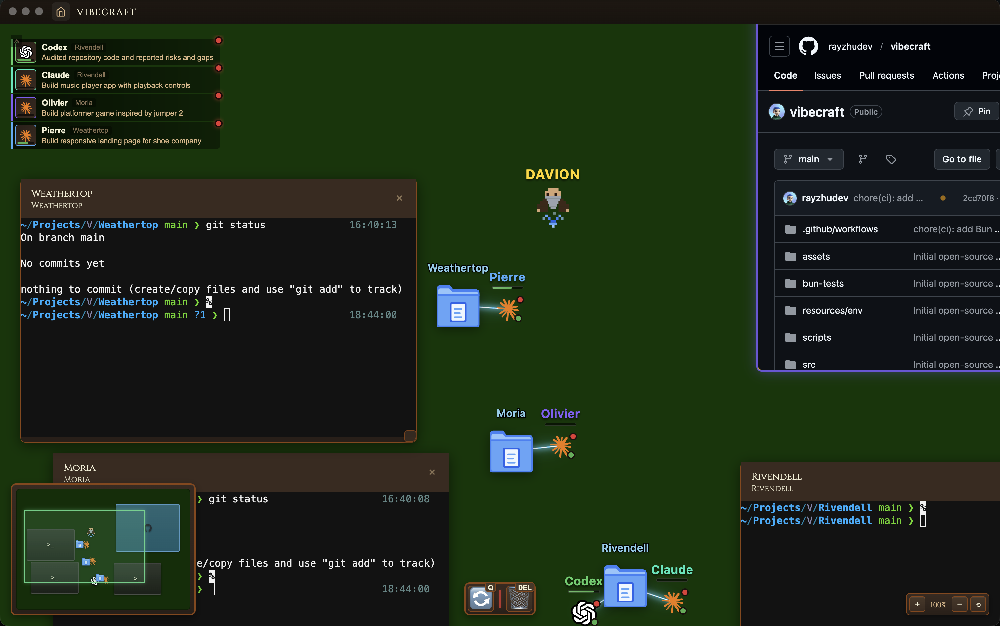

# VibeCraft



**RTS-Style AI Agent Management Interface**

VibeCraft is an Electron application that lets you manage AI coding agents (Claude Code and ChatGPT Codex) using a real-time strategy (RTS) game interface. Think of it like commanding units in a strategy game, but instead of soldiers, you're managing AI assistants that help you code.

## What is VibeCraft?

VibeCraft transforms AI agent management into an intuitive, visual experience. Instead of managing agents through command lines or complex interfaces, you interact with them like units in an RTS game:

- **Hero (Davion)**: Your guide - a character that helps you understand how to use VibeCraft
- **Agents**: Your AI assistants - visual tokens representing Claude Code or ChatGPT Codex agents
- **Projects (Folders)**: Workspace folders that agents can be attached to and work within
- **Canvas**: The game-like battlefield where all entities live - pan, zoom, and organize your workspace
- **HUD**: The information panel that shows details and abilities for whatever you select

## Requirements

- Node.js 20 or higher
- Bun (recommended)
- macOS, Windows, or Linux
- Optional: Claude Code CLI and/or Codex CLI for agent terminal workflows

## Documentation

- `user-docs/` - user-facing mechanics and feature guides
- `technical-docs/` - technical reference material
- `technical-docs/Architecture/CODEBASE.md` - architecture and implementation map
- `technical-docs/Reference/TESTING.md` - test modes and automation details
- `technical-docs/Reference/paywall.md` - subscription and paywall behavior notes

## Quick Start

### Installation (from `vibecraft/`)

Bun is the primary package manager for this repo.

```bash
# Install dependencies
bun install

# Run in development mode
bun run dev

# Build for production
bun run build

# Package for distribution
bun run package
```

If you prefer another package manager:

```bash
# npm
npm install
npm run dev
npm run build
npm run package

# pnpm
pnpm install
pnpm dev
pnpm build
pnpm package

# yarn
yarn install
yarn dev
yarn build
yarn package
```

### Optional local environment

If you want explicit local settings, copy the local template:

```bash
cp .env.local.example .env.local
```

Most contributors can leave licensing disabled locally. Only enable it when testing subscription UX.

### First Launch

1. **Start the app** - You'll see the home screen
2. **Create or Open a Workspace** - Choose "New Workspace" to create a new project, or "Open Workspace" to continue an existing one
3. **Meet the Hero** - The ⭐ icon is your Hero. This is your command center
4. **Create Your First Agent** - Use the ability buttons at the top to spawn a Claude or Codex agent
5. **Create a Project** - Add a folder/project to your workspace
6. **Attach an Agent** - Select an agent, then use "Attach to Project" to connect it to a folder

## Understanding the RTS Paradigm

### The Game World

VibeCraft uses RTS game mechanics to make agent management intuitive:

#### **Entities on the Canvas**

All your resources are represented as visual entities you can see and interact with:

- **Hero (⭐)**: Your command center. Always present, represents your control over the workspace
- **Agents (🤖/🧠)**: AI assistants you've created. Each has a status indicator showing if they're idle, online, or working
- **Projects (📁)**: Folder entities representing directories in your workspace
- **Browser Panels (🌐)**: Embedded browser windows for viewing web content
- **Terminal Panels**: Workspace terminals for interacting with agent processes

#### **The Canvas**

The main workspace is an infinite, pannable canvas:

- **Pan**: Hold `Shift` + right-drag, use middle mouse button, or two-finger scroll on a trackpad
- **Zoom**: Scroll wheel to zoom in/out, pinch on a trackpad, or use the zoom controls in the bottom-right
- **Select**: Click any entity to select it and see its details in the HUD
- **Move**: Drag entities to reposition them on the canvas

#### **The HUD (Heads-Up Display)**

When you select an entity, the HUD panel appears showing:

- **Details Panel**: Information about the selected entity (name, status, attached resources, etc.)
- **Abilities Panel**: Available abilities you can perform with that entity

#### **Entity Types & Their Roles**

**Hero**

- Your central command unit
- Currently serves as a visual anchor (future abilities coming soon)
- Always present in every workspace

**Agents**

- **Status Colors**:
  - Gray = Idle (not attached to a project)
  - Yellow = Starting (agent is launching)
  - Green = Online (agent is running and attached to a project)
  - Orange = Stopping (agent is shutting down)
  - Red = Error (something went wrong)
- **Abilities Available**:
  - Open Terminal - Interact with the agent's process directly
  - Clear History - Reset the agent's terminal history
  - Attach to Project - Connect the agent to a folder so it can work on that project
  - Detach - Disconnect the agent from its current project
  - Destroy - Remove the agent and clean up its terminal/history

**Projects (Folders)**

- Represent directories in your workspace
- Agents can be attached to projects to work on specific codebases
- **Abilities Available**:
  - Inline rename or import existing top-level folders from the workspace
  - Delete - Move the folder to the OS trash (with confirmation)
  - Remove - Delete the folder entity only (keeps the folder on disk)
  - Git worktrees: create, sync from source, merge to source, undo merge, retry restore conflicts
  - Conflict state is shown on the folder and clears automatically once resolved

**Browser Panels**

- Embedded browser windows for viewing documentation, APIs, or web tools
- **Abilities Available**:
  - Refresh - Reload the page
  - Close - Remove the browser panel

**Terminal Panels**

- Workspace terminals for interacting with agent processes
- **Abilities Available**:
  - Restart - Restart the terminal session
  - Close - Remove the terminal panel

## Controls & Navigation

### Mouse Controls

- **Left Click**: Select an entity
- **Left Click + Drag**: Move the selected entity
- **Shift + Left Click + Drag**: Pan the canvas
- **Middle Mouse + Drag**: Pan the canvas
- **Scroll Wheel**: Zoom in/out
- **Click Empty Space**: Deselect current entity

### Keyboard Shortcuts

- Use the zoom controls in the bottom-right corner for precise zooming
- Reset button (⟲) returns to default zoom and position

## Usage Guide

### Creating and Managing Agents

1. **Spawn an Agent**:
   - Use the ability buttons at the top of the canvas
   - Choose "Claude Agent" or "Codex Agent"
   - Give it a name when prompted
   - The agent appears on the canvas as a token

2. **Attach Agent to a Project**:
   - Select the agent (click on it)
   - Click "Attach to Project" in the Abilities panel
   - Choose which folder/project to attach to
   - The agent's status changes to "Online" (green) when successfully attached

3. **Open Agent Terminal**:
   - Select an agent
   - Click "Terminal" in the Abilities panel
   - A terminal window opens showing the agent's process output
   - You can interact with the agent directly through the terminal

4. **Detach an Agent**:
   - Select an attached agent
   - Click "Detach" in the Abilities panel
   - The agent stops working on that project and returns to "Idle" status

### Managing Projects

1. **Create a Project**:
   - Click "Project" in the top ability buttons
   - Choose a folder from your file system
   - The folder appears as a 📁 entity on the canvas

2. **Rename a Project**:
   - Select the folder entity
   - Click "Rename" in the Abilities panel
   - Enter the new display name

3. **Remove a Project**:
   - Select the folder entity
   - Click "Remove" in the Abilities panel
   - The entity is removed (the actual folder remains on disk)

### Using Browser Panels

1. **Create a Browser Panel**:
   - Click "Browser" in the top ability buttons
   - Enter a URL when prompted
   - A browser window appears on the canvas

2. **Interact with Browser**:
   - Click on the browser panel to select it
   - Use "Refresh" to reload the page
   - Use "Close" to remove the panel

### Organizing Your Workspace

- **Drag entities** to organize them spatially
- **Group related items** together (e.g., agents near their attached projects)
- **Use the sidebar** to quickly see all agents and jump to them
- **Pan and zoom** to navigate large workspaces

## Project Structure

```
vibecraft/
├── src/
│   ├── main/                    # Electron main process (backend)
│   │   ├── index.ts             # App entry point, window creation
│   │   ├── ipc.ts               # IPC handlers (communication bridge)
│   │   ├── logger.ts            # Logging utilities
│   │   └── services/            # Backend services
│   │       ├── agents/          # Agent process management
│   │       │   ├── ProcessManager.ts    # Core agent lifecycle management
│   │       │   ├── ClaudeRunner.ts      # Claude Code agent runner
│   │       │   └── CodexRunner.ts       # ChatGPT Codex agent runner
│   │       ├── workspace.ts     # Folder/project operations
│   │       ├── browser.ts       # Browser panel management
│   │       └── storage.ts       # JSON file persistence
│   │
│   ├── renderer/                # React frontend (UI)
│   │   ├── App.tsx              # Main app component with routing
│   │   ├── main.tsx             # React entry point
│   │   ├── screens/             # Top-level screen components
│   │   │   ├── HomeScreen.tsx           # Home/launch screen
│   │   │   ├── WorldSelection.tsx      # Workspace selection screen
│   │   │   └── WorkspaceView.tsx       # Main workspace canvas view
│   │   │
│   │   ├── components/          # UI components
│   │   │   ├── canvas/          # Canvas entities (game-like tokens)
│   │   │   │   ├── Canvas.tsx           # Main canvas with pan/zoom
│   │   │   │   ├── Entity.tsx           # Shared entity wrapper
│   │   │   │   ├── UnitEntity.tsx       # Unit base (hero/agent)
│   │   │   │   ├── BuildingEntity.tsx   # Building base (folder/browser/terminal)
│   │   │   │   ├── WindowedBuildingEntity.tsx # Windowed building base
│   │   │   │   ├── HeroEntity.tsx       # Hero entity
│   │   │   │   ├── AgentEntity.tsx      # Agent token entity
│   │   │   │   ├── FolderEntity.tsx     # Project/folder entity
│   │   │   │   ├── BrowserEntity.tsx     # Browser panel entity
│   │   │   │   └── TerminalEntity.tsx    # Terminal panel entity
│   │   │   │
│   │   │   ├── hud/             # HUD (Heads-Up Display) panels
│   │   │   │   ├── HUD.tsx              # Main HUD container
│   │   │   │   ├── DetailsPanel.tsx     # Entity information display
│   │   │   │   ├── AbilitiesPanel.tsx     # Ability buttons for entities
│   │   │   │   └── WorldAbilityPanel.tsx # Global creation abilities
│   │   │   │
│   │   │   ├── Sidebar.tsx              # Agent list sidebar
│   │   │   ├── FolderSelectDialog.tsx   # Folder selection dialog
│   │   │   ├── InputDialog.tsx          # Text input dialog
│   │   │   └── MessageDialog.tsx        # Message/alert dialog
│   │   │
│   │   └── styles/
│   │       └── index.css        # All application styles
│   │
│   ├── preload.ts               # IPC bridge (secure communication)
│   └── shared/
│       └── types.ts             # TypeScript type definitions
│
├── dist/                        # Build output directory
├── package.json                 # Dependencies and scripts
├── vite.config.ts              # Vite build configuration
├── tsconfig.json               # TypeScript configuration
└── electron-builder.json       # Electron packaging configuration
```

### Key Directories Explained

- **`main/`**: The Electron main process runs in Node.js and handles:
  - File system operations
  - Process management (starting/stopping agents)
  - IPC communication with the renderer
  - Data persistence

- **`renderer/`**: The React frontend runs in a browser-like environment and handles:
  - User interface and interactions
  - Canvas rendering and entity management
  - State management for UI
  - Communication with main process via IPC

- **`shared/`**: Code shared between main and renderer processes:
  - Type definitions
  - Constants
  - Shared utilities

## Data Storage

VibeCraft stores data in JSON files:

### Global Settings

- **Location**: `~/.vibecraft/`
- **Contains**: App settings, recent workspaces list

### Per-Workspace Data

- **Location**: `<workspace>/.vibecraft/`
- **Files**:
  - `agents.json` - All agent definitions and positions
  - `folders.json` - All folder/project entities
  - `browsers.json` - All browser panel configurations
  - `hero.json` - Hero position on canvas

All data is stored as plain JSON files, making it easy to backup, version control, or migrate workspaces.

## Configuration

App settings live in `settings.json` under the app user data directory.

Common keys:

- `heroProvider` / `heroModel`: persisted hero selection
- `defaultReasoningEffortByProvider`: preferred reasoning level per provider (applies to newly created agents only)

Example:

```json
{
  "heroProvider": "claude",
  "heroModel": "claude-sonnet-4-5-20250929",
  "defaultReasoningEffortByProvider": {
    "codex": "medium"
  }
}
```

## Licensing & Subscription

Local development keeps licensing checks disabled by default. To test subscription flows, set `VIBECRAFT_LICENSE_CHECK=1`.

Environment variables (main process):

- `VIBECRAFT_LICENSE_API_URL`: Base URL for the licensing backend. Defaults to `http://localhost:8787` in non-production.
- `VIBECRAFT_PRICING_URL`: Checkout page URL opened in the system browser. Defaults to `http://localhost:5173/checkout` in non-production.
- `VIBECRAFT_LICENSE_CHECK`: Set to `1` to enforce device access checks in development.

When licensing checks are enabled and the device is inactive, the subscription panel blocks the app until a trial or subscription is active. When active, the title bar shows a Subscription button that opens the pairing flow for additional devices.

## Troubleshooting

- **Agent won't start**: Check that the agent's process (Claude Code or Codex) is properly installed and configured
- **Terminal not responding**: Try closing and reopening the terminal, or detaching and reattaching the agent
- **Canvas feels laggy**: Try reducing zoom level or closing unused browser/terminal panels

## Development

See `technical-docs/` and `technical-docs/Architecture/CODEBASE.md` for technical documentation.

- Run `bun run typecheck` after making changes to ensure the Electron preload/renderer contracts stay in sync.

### Testing

VibeCraft has unit tests (main + renderer) and end-to-end tests that drive the Electron UI.

```bash
bun run test:unit
bun run test:e2e
bun run test
```

**Unit tests**

- Scope: main process services and renderer components
- Location: `tests/unit`
- Runner: Vitest (separate configs for main and renderer)

**E2E tests**

- Scope: full Electron app with UI interactions
- Location: `tests/e2e`
- Runner: Playwright (Electron)
- Data safety: runs in test mode with isolated temp `userData` and workspace paths, so it does not touch real workspaces or settings
- Build: `test:e2e` builds into a temporary `.e2e-dist-*` directory and cleans it up after the run
- Debug: set `VIBECRAFT_E2E_DEBUG=1` to keep Playwright output visible

If Playwright browsers are not installed on your machine yet:

```bash
bunx playwright install
```

See `technical-docs/Reference/TESTING.md` for test-mode and development overrides.

### Styling & Themes

The renderer consumes a layered theme system:

- **Foundation tokens** (defined in `src/renderer/theme/tokens.ts`) describe the colors, typography, and layout primitives every theme must provide so each screen stays legible.
- **Component overrides** are optional tokens. When supplied they let a theme customize specific treatments (title glow, menu bevels, world-card gradients); when absent the CSS falls back to the foundation palette.
- **Theme modules** are optional hooks for bespoke effects (particles, animated overlays, etc.) that components mount only if the theme exports them.

`ThemeProvider` injects the foundation variables, applies overrides, and exposes modules to React components. See `technical-docs/Architecture/CODEBASE.md` and `technical-docs/Reference/THEME_GUIDE.md` for deeper details and authoring guidelines.

When building new UI:

- Use CSS variables exclusively and provide sensible fallbacks for optional overrides.
- Only add foundation tokens when a value is critical for legibility; otherwise create an override or module hook and document it.
- Test by removing overrides in the default theme to ensure the component still looks acceptable.
